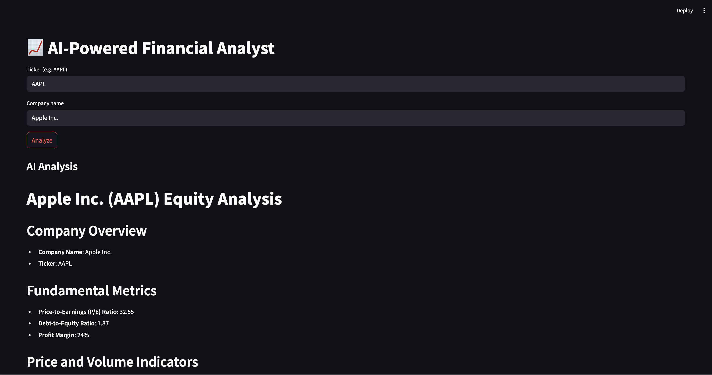
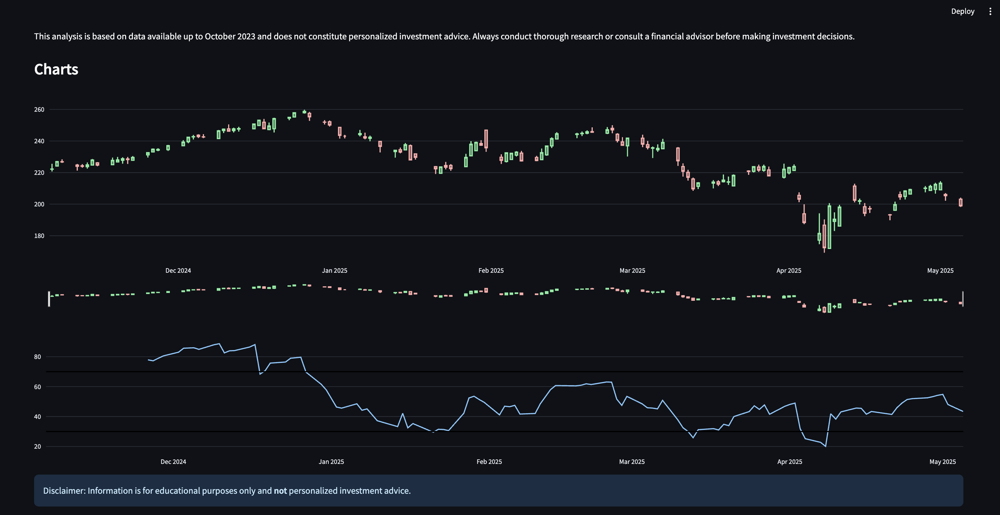

<!--
  ___________________________________________________________
 |                                                           |
 |    📈 AI-Powered LangGraph Financial Analyst — README.md  |
 |___________________________________________________________|
-->

# 📈 AI-Powered LangGraph Financial Analyst

[](https://www.python.org/)  
[](https://streamlit.io/)  
[](LICENSE)  

> An interactive, end-to-end Streamlit application that combines live financial data, technical indicators, fundamental metrics, and AI-generated commentary to produce equity research–style reports and visualizations.

---

## 🖼️ User Interface

 



---

## 📑 Table of Contents

1. [Features](#-features)  
2. [Technology Stack](#-technology-stack)  
3. [Prerequisites](#-prerequisites)  
4. [Installation](#-installation)  


---

## 🚀 Features

- **🔄 Automated Data Retrieval**  
  - Pulls 6+ months of historical price data from Yahoo Finance  
  - Fetches latest income statement, balance sheet & cash flow via Financial Modeling Prep  
- **📊 Technical Indicators**  
  - Computes RSI, MACD, VWAP, Bollinger Bands, and moving averages using `pandas_ta`  
- **📈 Interactive Charts**  
  - Candlestick + overlay indicators powered by Plotly  
  - Dynamic volume bars, zoom & pan  
- **🤖 AI-Generated Commentary**  
  - Sends snapshots of price & fundamentals to GPT-4o-mini  
  - Returns markdown-formatted “equity research” write-up with actionable insights  
- **⚖️ Fundamental Metrics**  
  - Calculates P/E, debt-to-equity, profit margin, ROE, current ratio  
- **🎨 Theming & Layout**  
  - Light/dark mode support  
  - Responsive, mobile-friendly design  
- **🛡️ Disclaimer**  
  - Educational purposes only – **not** personalized investment advice  

---

## 🧰 Technology Stack

| Component           | Library / Service                    |
| ------------------- | -------------------------------------|
| **Web UI**          | [Streamlit](https://streamlit.io/)   |
| **Data Retrieval**  | [yfinance](https://github.com/ranaroussi/yfinance) <br> [Financial Modeling Prep API](https://financialmodelingprep.com/) |
| **Indicators**      | [pandas_ta](https://github.com/twopirllc/pandas-ta) |
| **Charts**          | [Plotly](https://plotly.com/python/) |
| **AI Engine**       | [OpenAI API (GPT-4o-mini)](https://openai.com/) |
| **Env Variables**   | [python-dotenv](https://github.com/theskumar/python-dotenv) |
| **Package Mgmt**    | pip / Virtualenv                     |

---

## 🛠️ Prerequisites

- **Python 3.8+**  
- **API Keys**  
  1. `FMP_API_KEY` (Financial Modeling Prep)  
  2. `SERPAPI_API_KEY` (optional – for advanced searches)  
  3. `OPENAI_API_KEY`  

---

## ⚙️ Installation

1. **Clone the repository**  
   ```bash
   git clone https://github.com/ofarooq21/LangGraph-Financial-Analyst.git
   cd <LangGraph-Financial_Analyst>
